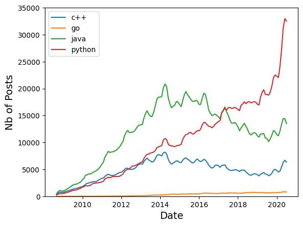

## Stackoverflow Programming Languages Posts Data Analysis

### Description:
This Python notebook is prepared for data analysis of the `stackoverflow_pl_posts.csv`. The number of posts for each programming language throughout the years are presented.

### 🔍 Features & Learning Outcomes
- Pandas library and Dataframe
- Matplotlib library
- Important functions used: pivot, fillna, groupby, pd.to_datetime

### Outcome
- The below plot shows the number of posts asked on stackoverflow for each specified programming languages as a time-series data
- Python is the most popular one

